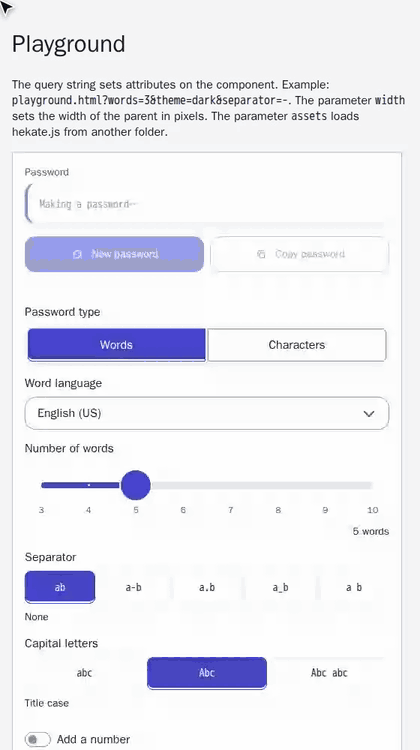

<p align="center">
  
</p>

<p align="center"><sub>Banner art created with ChatGPT.</sub></p>

# Hekate

> Familiar words. Stronger passwords.

In old stories, Hekate is the goddess of keys and crossroads. Our Hekate holds the keys to your accounts. She makes them fresh, random, and strong. 🗝️

Hekate is a **web component**. That means one HTML tag, `<hekate-generator>`, that any website can use.

## What can she do?

- **Word passwords.** Hekate picks random words from a word list, like `CorrectHorseBatteryStaple`. They are easy to remember and hard to guess. There are word lists for 15 languages.
- **Character passwords.** Hekate picks random letters, digits, and symbols. Good when a site wants a wild one.
- **Strength estimate.** She shows the entropy in bits, a strength label, and how long an attacker needs to crack the password. Entropy tells you how hard a password is to guess. Each extra bit doubles the number of guesses.
- **Private.** Everything happens in your browser. Hekate sends no data to any server. Random numbers come only from the secure random generator of your browser.

Under the hood: Rust (compiled to WebAssembly, or "WASM") and TypeScript. The look comes from [Web Awesome](https://webawesome.com) 3.14.0 and Lit.

Want the full list of rules? Read the [product requirements](docs/PRD.md). The [implementation notes](docs/implementation-notes.md) tell what differs from it and what work is still open.

## Using Hekate

Open a page that has Hekate. A password is waiting for you.

<p align="center">
  
</p>

- Pick **Words** or **Characters**.
- In word mode, pick a language and how many words you want. You can add a number and a symbol. Switch on **ASCII only** if a site does not like letters such as `é` or `ö`.
- In word mode, changing the separator, capital letters, number, or symbol keeps your words. Only the dressing changes.
- Some sites hate the same character twice in a row. Switch on **No same character twice in a row**. Uppercase and lowercase count as the same, so `aA` is not allowed either. It works in both modes.
- In character mode, pick the length and the character sets.
- Press **New password** for another one.
- Press **Copy** to copy it.

Under the strength you see two estimates. The main one assumes the attacker knows how Hekate made the password. The second one is for an attacker who knows nothing.

> ⚠️ **Hekate does not clear the clipboard.** A web page cannot do that reliably after you leave. The password stays there until you copy something else, and other programs on your device can read it. Paste your password where you need it, then copy some other text.

## Put Hekate on your website

Add one script tag and one `<hekate-generator>` tag:

```html
<script
  type="module"
  src="https://assets.example.com/2026.10.06-1432/hekate.js"
  integrity="sha384-VALUE_FROM_sri.txt"
  crossorigin="anonymous"
></script>

<hekate-generator language="sv" words="5" separator="-">
  Your browser cannot show the password generator.
</hekate-generator>
```

Every version lives in its own folder, and the script is checked with a hash (SRI), so nobody can swap it behind your back. The full guide has all you need:

**➡️ [Embed Hekate in your website](docs/embedding.md)**

It covers:

- all attributes (language, number of words, separator, theme, and more)
- styling with CSS variables and `::part()`
- deploying the files, response headers, and Content Security Policy
- trust, NFC text, and privacy

Hekate works in the last 2 major versions of Chrome, Edge, Firefox, and Safari, in iOS Safari 17 and later, and in Android Chrome. The page must use HTTPS (or `localhost`).

## Build it yourself

You need:

- Rust (the version in `rust-toolchain.toml`)
- Node.js (the version in `.node-version`)
- pnpm (the version in `package.json`)
- the `wasm-bindgen` command line tool, in the version of `Cargo.lock` (0.2.129)

```sh
pnpm install
cargo xtask dist
```

`cargo xtask dist` builds the word lists, then the WASM module, then the component. It writes `dist/<version>/`. The version is the UTC time of the HEAD commit. Build one commit twice and you get the same files.

Other handy commands:

```sh
cargo xtask wordlists         # build the word lists
cargo xtask wasm              # build the WASM module
cargo test --workspace        # Rust tests
pnpm test                     # component tests
node --test 'scripts/test/*.test.mjs'   # tests of the check scripts
```

## Try it on your computer

The dev server runs in Docker. It serves the demo page on <http://localhost:18080> and the asset files on <http://localhost:18081>. Two origins let the tests load the component from a second origin. The server only serves files, so build `dist/` and the demo page first.

```sh
cargo xtask dist
pnpm --filter @hekate/demo build

docker build --tag hekate-dev dev
docker run --rm --name hekate-dev \
  --publish 18080:18080 --publish 18081:18081 \
  --volume "$PWD/dist:/srv/dist:ro" \
  --volume "$PWD/apps/demo/out:/srv/demo:ro" \
  hekate-dev
```

`dev/run.sh` runs the same two commands. CI uses the same image and configuration for the end-to-end tests.

**Port already taken?** If <http://localhost:18080> gives an empty reply or "connection reset", another program uses that port. The server is fine. Check with `docker exec hekate-dev wget -qO- http://127.0.0.1:18080/`, and run `lsof -nP -iTCP:18080 -sTCP:LISTEN` to see who has the port. Then pick another port for the demo page, for example `HEKATE_DEMO_PORT=28080 dev/run.sh`, and open <http://localhost:28080>. Port 18081 stays the same. The end-to-end tests need both 18080 and 18081.

## Join the circle

Want to help? Read [CONTRIBUTING.md](CONTRIBUTING.md). Found a security problem? Please follow [SECURITY.md](SECURITY.md).

## License and credits

- **Code:** MIT. See [LICENSE](LICENSE).
- **Word lists:** each list keeps the licenses of its sources. Each folder `wordlists/<code>/` has a `LICENSE` file and a `CREDITS.md` file. Some sources use copyleft licenses (GPL, LGPL, MPL, EUPL). Copyleft means changed versions must use the same license. Hekate keeps each word list in its own file and never puts a list inside the WASM module or the script. So the copyleft rule covers only the list file, not your site.
- **Credits:** the component shows the credits of all word list sources in its Credits dialog. The file `NOTICE` lists them too.
- **Dependencies:** `dist/<version>/THIRD-PARTY-LICENSES.html` lists the licenses of all dependencies.
- **Banner:** created with ChatGPT.
